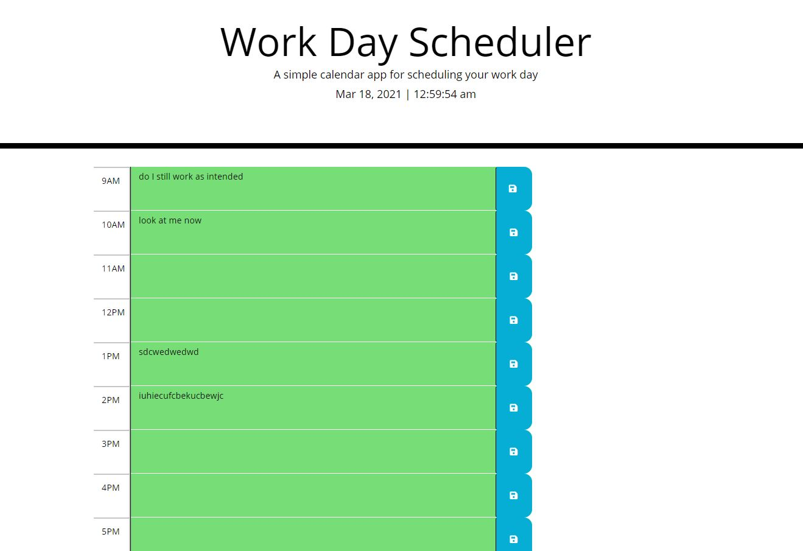

# 05 Third-Party APIs: Work Day Scheduler

## Your Task

Create a simple calendar application that allows a user to save events for each hour of the day by modifying starter code. This app will run in the browser and feature dynamically updated HTML and CSS powered by jQuery. The planner should highlight the time of day in various colors and save enteries 


## Acceptance Criteria

```md

GIVEN I am using a daily planner to create a schedule

WHEN I open the planner
THEN the current day is displayed at the top of the calendar

WHEN I scroll down
THEN I am presented with timeblocks for standard business hours 

WHEN I view the timeblocks for that day
THEN each timeblock is color coded to indicate whether it is in the past, present, or future 

WHEN I click into a timeblock
THEN I can enter an event

WHEN I click the save button for that timeblock
THEN the text for that event is saved in local storage 

WHEN I refresh the page
THEN the saved events persist 

```

## Review

the following are required for review:

* The URL of the deployed application 
  https://jasonrosasramirez.github.io/05-Planner-for-Your-Work-Day/

* The URL of the GitHub repository, with a unique name and a README describing the project
  https://github.com/Jasonrosasramirez/05-Planner-for-Your-Work-Day

* 

- - -

## References 

Notes provided by © 2021 Trilogy Education Services, LLC, a 2U, Inc. brand. Confidential and Proprietary. All Rights Reserved.

[Moment.js](https://momentjs.com/)
The following animation demonstrates the application functionality:


